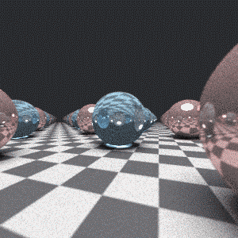

# Everyday One Motion - 20160602  

"My First Raymarch Pathtracer"  

  

JavaScript, WebGL, Raymarcher, Pathtracer  

[Everyday One Motion](http://motions.work/motion/253)  
[Demo Page](http://fms-cat-eom.github.io/20160602/dist)  

## 今月のテーマ

今月のテーマは「Pathtracer」になりそうです。  

## Pathtracer

Raytracerは、カメラから光を逆探索し、光の物体との衝突点から再び光を進ませることにより、反射や屈折を表現しています。しかし、拡散反射については、光を再び進ませることはせず、法線の向きと光源の位置からだいたいで計算しています。  
Pathtracer（∋ Raytracer）ではさらに、拡散反射光も光を衝突点から進ませて再現します。これにより、よりリアルな陰影表現が可能となります。  

## モンテカルロ法

それでは、Pathtracerではどのように拡散反射光を再現するでしょう？  
なんと、衝突点からランダムな方向に光を進ませることにより、まさに「拡散」を再現しています。  
「しかし、それではでたらめな計算結果が得られるのでは？」と思いますが、このランダムに光を進ませる試行を複数回繰り返せば、最終的に計算結果は正しい値に収束します。魔法のようですよね。  

## このへんわかりづらい

ので、来週あたりに2Dのわかりやすい絵で紹介します。
